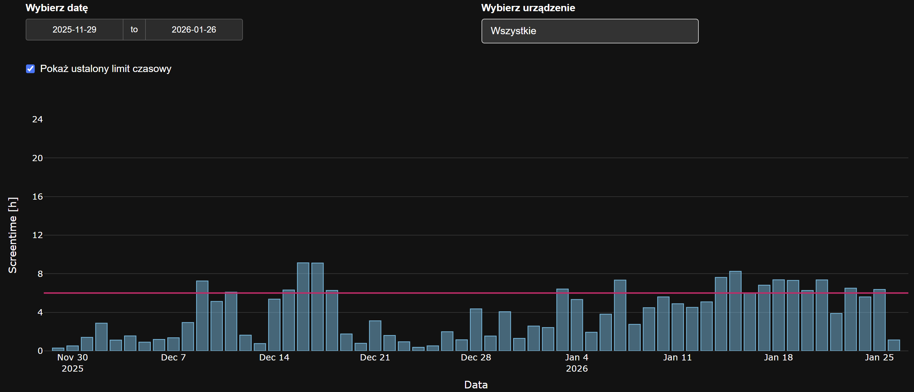
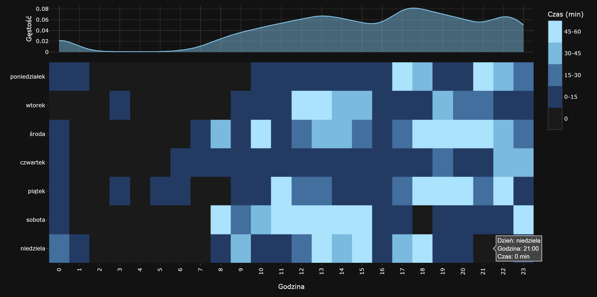
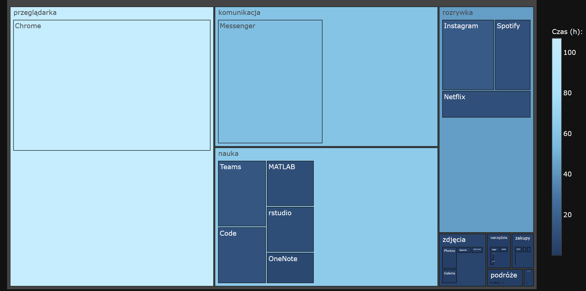
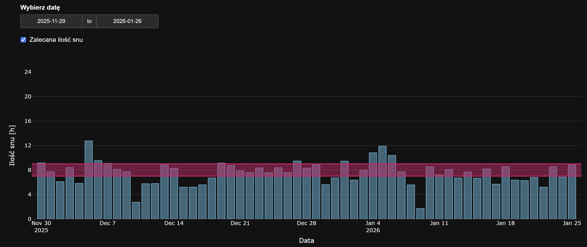

# Project_screentime_analysis
This R Shiny app was created for the Data Visualization Techniques course at the Faculty of Mathematics and Information Science, Warsaw University of Technology.
 
The app presents the results of an analysis of our screen time in the form of four charts:
 
- **Screen time by day.**

- **Screen time in a selected week by hour of the day.** The total and average number of hours spent on screen are also calculated.

- **Most frequently used apps, grouped by category.** The treemap shows each app's and category's share of total screen time, represented by the color scale and the size of the tiles.

- **Sleep duration.** Estimated based on the phone's last activity of the night and the last morning alarm. The chart also shows the average and latest wake-up time.

## Data source
 
The data was collected using [ActivityWatch](https://activitywatch.net) over the following periods:
 
- 29 Nov 2025 – 26 Jan 2026 for phones,
- 8 Dec 2025 – 26 Jan 2026 for computers.
## Libraries
 
- shiny
- jsonlite
- dplyr
- tidyr
- tibble
- plotly
- lubridate
- hms
- fontawesome
- treemapify
